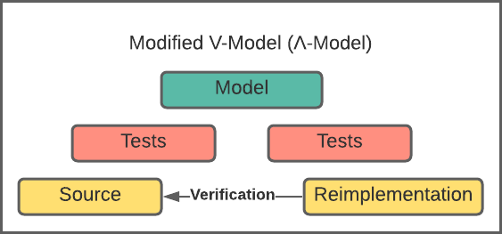

# A method for porting software using formal specifications

An example of the method proposed to apply formal specifications to the process of porting code.
In this example the linked list module of [FreeBSD](https://github.com/freebsd/freebsd-src/blob/main/sys/sys/queue.h) has been ported to Rust.

The method can be seen as an inversion of the V-model.



The complete report can be read [here](markdown/report.pdf).

The method consists of several steps, starting from an existing source.

- Creating tests for the source to ascertain its behaviour.
- Creating a formal specification based these tests and defining the invariants.
- Reimplementing the functionality based on the formal specification.
- Verifying that the behaviour of the ported code conforms to the original, using a verification test-suite.

Each step of the method is found in this repo in a separate directory:

- source_tests: the test suite used to ascertain the behaviour of the C-code
- spec: the formal specification, or model.
- reimplementation: The reimplementation in Rust.
- verification: the verification test suite.

Any scripts in this repository are written to run on linux.

## Getting started
### Source tests
##### [/source_tests](/source_tests) for detailed readme
Tools used:
- [RapidCheck](https://github.com/emil-e/rapidcheck) a quickcheck implementation for C++.
- [GoogleTest](https://github.com/google/googletest)
- lcov, gcov
- CMake

#### Running:
##### Using CLion:
- Press run ▶️

To generate coverage report
```
$ ./coverage_report.sh
```

##### Using CMake manually:
```
$ mkdir build && cd build
$ cmake ..
$ make
$ ./project
```
To generate coverage report
```
$ cd build/CMakeFiles/project.dir/src
$ gcov queue_impl.cpp.gcno
$ lcov --capture --directory . --rc lcov_branch_coverage=1 --output-file gtest_coverage.info
$ genhtml gtest_coverage.info --branch-coverage --output-directory ../../../../COVERAGE_VIEW
```


### Model
##### [/spec](/spec) for detailed readme
The spec is implemented in the TLA+ language.
Tools used:
- [TLA+ Toolbox](https://lamport.azurewebsites.net/tla/toolbox.html)

- Start the toolbox and load the spec files ([main.tla](spec/main.tla))
If any changes are made to the file, changes must be translated from PlusCal to TLA+ (File->Translate PlusCAl Algorithm)

- Right click >models, found in the left hand "Spec Explorer", select new model and give it a name
- Double click the new model to open it.
- Provide values for the model constants, NULL -> NULL, VALUE can be set to a value e.g. 1, or a set e.g. {1,2}

For the model to perform any checking add the invariants:
- HasFirst
- HasLast
- NullNotInDomain
- ValidList
- RemoveInvariant
- RemovePrevInvariant
- InsertInvariant
- ConcatInvariant
- SwapInvariant
- NextInvariant
- ForEachedList
- ForEachedFromList

Run the model by pressing the run button ▶️

### Reimplementation
##### [/reimplementation/rust_slist](/reimplementation/rust_slist) for detailed readme
Tools used:
- [Cargo](https://www.rust-lang.org/tools/install) comes with Rust default install.
- To generate C bindings for the library [cbindgen](https://github.com/eqrion/cbindgen) is used. 

The reimplementation contains 2 versions of the linked list as rust structures.
At the top layer the interface for the verification tests is found.
The implementations are found in /singly_linked_list/src 
- Running the tests (with output in order):
```
$ cd singly_linked_list && cargo test --nocapture --test-threads=1
```
- Building the library (done automatically by the verification tests):

```
$ cargo build --lib
```
- Generating C bindings (done automatically by the verification tests):
```
$ cbindgen --config cbindgen.toml --crate singly_linked_list_rust --output OUTPUT_FILE
```

### Verification
##### [/verification](/verification) for detailed readme
The verification tests are based on the tests from /source_tests
This directory contains copies of the liked list C-source rather including them from /source_tests.

Note that to change the test-target library (RustLib_Uns, RustLib or the Clib)
```
lib_agnostic_SLIST_test.cpp:
...
18: using CurListType = RustLib_Uns;
...
```


##### Using CLion:
- Press run ▶️

##### Using CMake manually:
```
$ mkdir build && cd build
$ cmake ..
$ make
$ ./verification_test
``